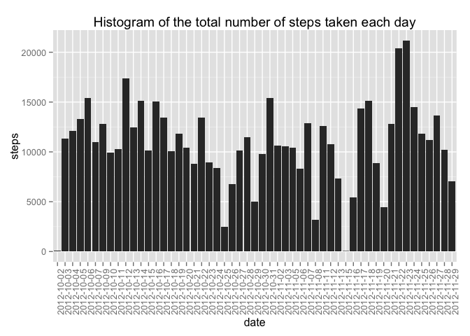
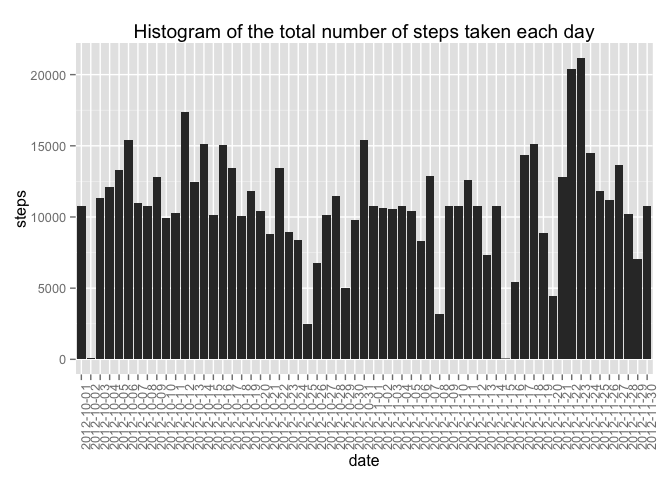
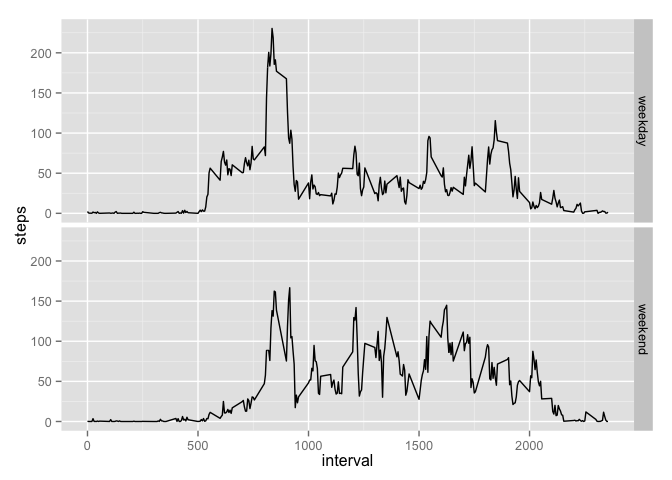

# Reproducible Research: Peer Assessment 1
by Kriddiphat Kongsupapsiri

## Loading and preprocessing the data
1. Load the data


```r
unzip("activity.zip")
activity <- read.csv("activity.csv")
```

2. Load library "ggplot2"


```r
library(ggplot2)
```

## What is mean total number of steps taken per day?
1. Make a histogram of the total number of steps taken each day


```r
stepsDate <- aggregate(steps ~ date, data=activity, sum)
stepsDate$date <- as.factor(stepsDate$date)
qplot(y=steps, x=date, data=stepsDate, geom="bar", stat="identity", 
      main="Histogram of the total number of steps taken each day") + 
    theme(axis.text.x = element_text(angle = 90, hjust = 1))
```

 

2. Calculate and report the **mean** and **median** total number of
   steps taken per day
   

```r
mean(stepsDate$steps, na.rm=TRUE)
```

```
## [1] 10766.19
```

```r
median(stepsDate$steps, na.rm=TRUE)
```

```
## [1] 10765
```

## What is the average daily activity pattern?
1. Make a time series plot of the 5-minute
   interval (x-axis) and the average number of steps taken, averaged
   across all days (y-axis)


```r
stepsInterval <- aggregate(steps ~ interval, data=activity, mean)
qplot(interval, steps, data=stepsInterval, geom="line")
```

 

2. Calculate 5-minute interval, on average across all the days in the dataset
, contains the maximum number of steps


```r
stepsInterval$interval[which.max(stepsInterval$steps)]
```

```
## [1] 835
```

## Imputing missing values
1. Calculate and report the total number of missing values in the dataset

```r
sum(is.na(activity$steps))
```

```
## [1] 2304
```

2. Devise a strategy for filling in all of the missing values in the dataset
(Using mean for 5-minute interval)


```r
adjActivity <- merge(activity, stepsInterval, by="interval")
na <- is.na(adjActivity$steps.x)
adjActivity$steps.x[na] <- adjActivity$steps.y[na]
colnames(adjActivity)[2] <- "steps"
adjActivity <- adjActivity[, c(1:3)]
```

3. Make a histogram of the total number of steps taken each day and Calculate 
and report the **mean** and **median** total number of steps taken per day


```r
adjStepsDate <- aggregate(steps ~ date, data=adjActivity, sum)
adjStepsDate$date <- as.factor(adjStepsDate$date)
qplot(y=steps, x=date, data=adjStepsDate, geom="bar", stat="identity", 
      main="Histogram of the total number of steps taken each day") + 
    theme(axis.text.x = element_text(angle = 90, hjust = 1))
```

 


```r
mean(adjStepsDate$steps, na.rm=TRUE)
```

```
## [1] 10766.19
```

```r
median(adjStepsDate$steps, na.rm=TRUE)
```

```
## [1] 10766.19
```

The mean and the median total number of steps taken per day slightly differ from
the previous. This show that the impact of imputing missing data is rather low.

## Are there differences in activity patterns between weekdays and weekends?

1. Create a new factor variable in the dataset with two levels – "weekday"
and "weekend"" indicating whether a given date is a weekday or weekend day.


```r
adjActivity$dayType <- weekdays(as.Date(adjActivity$date))
weekend <- c("Saturday", "Sunday")
weekday <- c("Monday", "Tuesday", "Wednesday", "Thursday", "Friday")
adjActivity$weekType[adjActivity$dayType %in% weekend] <- "weekend"
adjActivity$weekType[adjActivity$dayType %in% weekday] <- "weekday"
```

2. Make a panel plot containing a time series plot of the 5-minute interval 
(x-axis) and the average number of steps taken, averaged across all weekday days
or weekend days (y-axis)


```r
adjStepsInterval <- aggregate(steps ~ weekType + interval, data=adjActivity, mean)
qplot(interval, steps, data=adjStepsInterval, geom="line", facets=weekType ~.)
```

 
